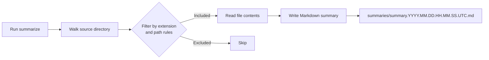

## The problem

When you need to ask an AI a question about your codebase, you have to get your source code into the conversation first. Copying files one by one is slow, and most AI tools have no way to browse your filesystem directly. You need a single, readable snapshot of your project that you can paste, pipe, or attach in seconds.

`summarize` solves this. Run it from any project directory and it produces a single Markdown file containing the full source of every relevant file — structured so AI tools can read it immediately.

## How it works

`summarize` scans a source directory, filters files by extension and path rules, then writes a timestamped Markdown file to a `summaries/` subdirectory. Processing is concurrent, so large projects finish quickly.



The tool respects three filter lists you can override at any time:

- **Include extensions** (`-i`): only these extensions are collected (default: `go,ts,tf,sh,py,js,Makefile,mod,Dockerfile,dockerignore,gitignore,esconfigs,md`)
- **Exclude extensions** (`-x`): these extensions are always skipped (binaries, media, certificates, and more)
- **Skip substrings** (`-s`): any file path containing one of these strings is skipped (default includes `node_modules/`, `.git/`, `summaries/`, and others)

## Output format

Every summary file follows this structure:

```markdown
# Project Summary

<AI prompt description>

### `filename.go`

<File Info>

<full source code>

### `filename.cs`

<File Info>

<full source code>

... etc.
```

Each file gets its own `###` heading with a fenced source block. You can `cat` the output directly into an AI prompt, pipe it with `-print`, or attach it as a file.

## Where to go next

<CardGroup cols={2}>
  <Card title="Quickstart" icon="rocket" href="/quickstart">
    Generate your first summary in under a minute.
  </Card>
  <Card title="CLI flags" icon="terminal" href="/usage/cli-flags">
    Full reference for every flag and its default value.
  </Card>
  <Card title="AI chat" icon="robot" href="/ai/overview">
    Start an interactive AI session using your summary as context.
  </Card>
  <Card title="Config file" icon="file-lines" href="/usage/config-file">
    Persist your settings in a YAML or JSON config file.
  </Card>
</CardGroup>

<Note>
Add `summaries/` to your `.gitignore` and `.dockerignore`. The directory contains generated files that change on every run and should not be committed or shipped in images.
</Note>
